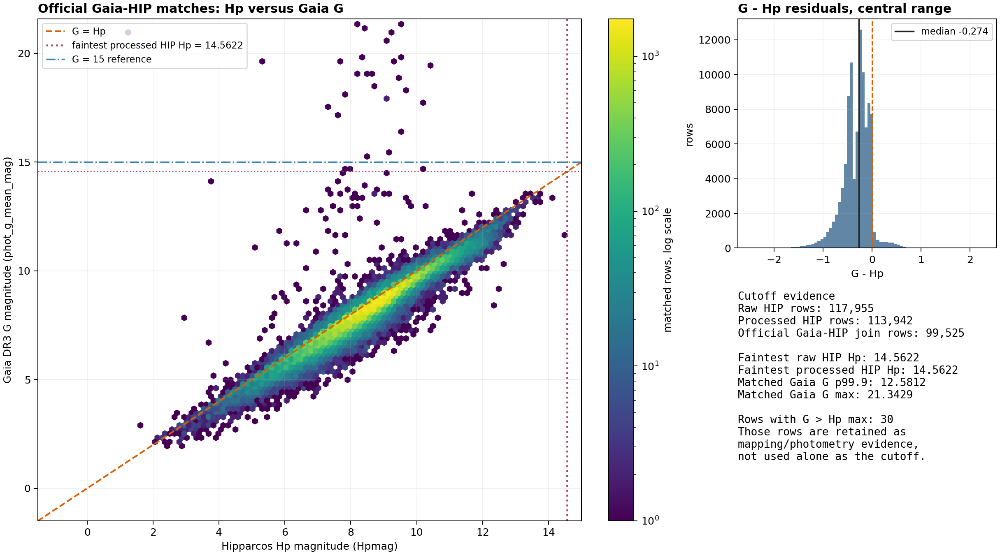

# Gaia-HIP Supplemental Display De-Duplication Map

Publication: `20260515.1`

Found in Space

## Abstract

When Gaia DR3 and Hipparcos-2 are rendered together, some real-world sky views
show visually obvious duplicate stars: one source from Gaia and one from
Hipparcos, close enough in sky position and apparent brightness to appear as
the same displayed object. The official Gaia-Hipparcos2 best-neighbour
crossmatch remains the scientific baseline, but it does not remove all such
display artefacts.

This publication provides a Found-In-Space supplemental display
de-duplication map containing `15,916` Gaia-Hipparcos2 identifier pairs not
covered by the official Gaia `hipparcos2_best_neighbour` table. The map is a
delta catalogue: it is intended to be applied alongside the official Gaia
crossmatch, not as a replacement for it. The selection policy is deterministic:
local one-to-one sky proximity, no official best-neighbour or neighbourhood
conflict, and either a very tight sky separation (`<= 0.25 arcsec`) or a
parallax-derived rendered 3D separation of `<= 1 pc`.

## 1. Introduction

Found in Space builds rendered star datasets by combining multiple source
catalogues. Gaia DR3 provides the main modern astrometric catalogue, while
Hipparcos remains important for bright-star coverage and historic identifiers.
When the official Gaia-Hipparcos2 crossmatch under-links sources that are
visually indistinguishable in the renderer, duplicate points can appear in
final sky views.

The aim of this publication is narrow. It does not attempt to produce a new
scientific Gaia-Hipparcos crossmatch. Instead, it publishes a supplemental
mapping delta that helps a display pipeline collapse obvious duplicate render
artefacts while continuing to use the official Gaia crossmatch as the baseline.

## 2. Inputs

| Input | Role | Rows Used |
| --- | --- | ---: |
| Hipparcos-2 / VizieR `I/311` | HIP identifiers, J1991.25 positions, proper motions, magnitudes, parallaxes | `117,955` |
| Gaia DR3 `gaia_source`, `G <= 15` | Gaia identifiers, J2016 sky positions, photometry, parallaxes | `36,909,365` |
| Gaia DR3 `hipparcos2_best_neighbour` | Official Gaia-Hipparcos2 baseline map | `99,525` |
| Gaia DR3 `hipparcos2_neighbourhood` | Official good-neighbour conflict check | `100,010` |

Large Gaia source downloads are not included in this publication. The exact
query, async job state, checksums, and conversion summary are included as
evidence artifacts.

## 3. Magnitude Cutoff And Coverage

The raw Hipparcos-2 catalogue contains `117,955` rows. The processed
finite-distance Hipparcos subset used by the pipeline contains `113,942` rows,
with a faintest processed `Hpmag` of `14.5622`. Official Gaia-Hipparcos2 rows
joined to Gaia photometry contain `99,525` rows, of which `99,463` have finite
Gaia `G`.

The Hipparcos `Hp` to Gaia `G` relationship was used to choose a Gaia download
limit for the matching scan. A full-sky Gaia `G <= 15` raw-field download was
large but operationally manageable, and covered the faint Hipparcos tail without
requiring thousands of cone queries.



| Quantity | Value |
| --- | ---: |
| Raw Hipparcos rows | `117,955` |
| Processed finite-distance Hipparcos rows | `113,942` |
| Faintest processed Hipparcos `Hpmag` | `14.5622` |
| Official Gaia-HIP rows joined to Gaia photometry | `99,525` |
| Official rows with finite Gaia `G` | `99,463` |
| Official rows with Gaia `G > 14.5622` | `30` |
| Gaia `G <= 15` raw parallax rows | `36,909,365` |

## 4. Methodology

### 4.1 Position Preparation

Hipparcos-2 positions were propagated from epoch J1991.25 to the Gaia epoch
J2016.0 using the Hipparcos proper motions. Gaia positions were taken directly
from the Gaia DR3 source table.

### 4.2 Candidate Scan

The raw candidate scan used a spherical KD-tree over the propagated Hipparcos
positions. Gaia sources with `G <= 15` were streamed in batches and compared
against Hipparcos sources within `5 arcsec`.

For every close Gaia-Hipparcos candidate pair, the evidence table records:

- Gaia and HIP identifiers;
- Gaia and propagated HIP positions;
- sky separation in arcseconds;
- Gaia `G`, `BP`, `RP`, and Hipparcos `Hp`;
- Gaia and Hipparcos parallaxes and parallax fractional errors;
- parallax-derived Gaia and Hipparcos distances;
- rendered 3D separation in parsecs;
- official best-neighbour and neighbourhood conflict flags;
- local candidate uniqueness counts;
- decision, recommended action, severity, and reason codes.

Raw magnitude difference is recorded as evidence, not used as a default hard
gate. This decision follows the observed colour-dependence of `G - Hp` and the
fact that the official Gaia crossmatch method is positional rather than
photometric.

### 4.3 Display Match Policy

| Rule | Action |
| --- | --- |
| Official Gaia-Hipparcos2 best-neighbour pair | Preserve as official baseline |
| Local pair is not one-to-one | Do not auto-map; record as manual/review evidence |
| Pair conflicts with official best-neighbour map | Do not auto-map |
| Pair conflicts with official neighbourhood table | Do not auto-map |
| One-to-one non-official pair, separation `<= 0.25 arcsec` | Add supplemental display match |
| One-to-one non-official pair, `0.25 < separation <= 5 arcsec`, rendered 3D separation `<= 1 pc` | Add supplemental display match |
| One-to-one non-official pair, rendered 3D separation `> 1 pc` | Keep visible separately |
| Missing usable parallax distance outside the tight sky rule | Keep visible separately |

The rendered 3D separation is computed from Gaia and Hipparcos parallax
distances:

```text
distance_pc = 1000 / parallax_mas
```

Pairs with non-positive or missing parallaxes do not receive a rendered
distance decision unless they already pass the tight sky rule.

## 5. Findings

The final parallax-aware scan produced `126,220` Gaia-Hipparcos evidence pairs
within `5 arcsec`.

| Decision | Rows | Meaning |
| --- | ---: | --- |
| `official_confirmed` | `92,620` | Official best-neighbour pair recovered cleanly in the local scan |
| `manual_review` | `16,753` | Ambiguous or official-conflicting local evidence |
| `supplemental_match` | `15,916` | Found-In-Space supplemental display match |
| `display_separate` | `931` | Close on sky, but not collapsed by the display policy |

The supplemental matches split as follows:

| Supplemental route | Rows |
| --- | ---: |
| Tight sky separation `<= 0.25 arcsec` | `15,725` |
| Non-tight, rendered 3D separation `<= 1 pc` | `191` |

The `display_separate` diagnostics split as:

| Diagnostic | Rows |
| --- | ---: |
| Finite rendered 3D separation, above threshold | `739` |
| Missing rendered 3D separation | `192` |

Magnitude remains useful diagnostic evidence. Among supplemental matches:

| Statistic for `abs(G-Hp)` | Value |
| --- | ---: |
| Median | `0.244000` |
| 90th percentile | `0.531337` |
| 95th percentile | `0.655862` |
| 99th percentile | `1.010475` |
| Maximum | `2.586314` |
| Rows with `abs(G-Hp) > 0.5` | `1,917` |
| Rows with `abs(G-Hp) > 1.0` | `166` |

These values support the decision not to use a strict raw magnitude gate for
automatic display de-duplication.

## 6. Published Outputs

| Artifact | Description | Rows | Size |
| --- | --- | ---: | ---: |
| [`catalog/fis_gaia_hip_supplemental_display_map.parquet`](catalog/fis_gaia_hip_supplemental_display_map.parquet) | Published FIS supplemental mapping delta | `15,916` | `241,298` bytes |
| [`evidence/gaia_hip_display_match_evidence.parquet`](evidence/gaia_hip_display_match_evidence.parquet) | Full candidate evidence table | `126,220` | `22,065,837` bytes |
| [`evidence/gaia_hip_display_match_report.json`](evidence/gaia_hip_display_match_report.json) | Machine-readable match summary | n/a | `1,802` bytes |
| [`evidence/gaia_g15_parallax_download.adql`](evidence/gaia_g15_parallax_download.adql) | Exact Gaia parallax download query | n/a | `176` bytes |
| [`evidence/gaia_g15_parallax_download_state.json`](evidence/gaia_g15_parallax_download_state.json) | Gaia async job metadata | n/a | `1,120` bytes |
| [`evidence/gaia_g15_parallax_conversion_summary.json`](evidence/gaia_g15_parallax_conversion_summary.json) | VOTable-to-Parquet conversion summary | n/a | `656` bytes |

The local combined official-plus-supplemental map is intentionally not
published. Downstream pipelines should compose the official Gaia
`hipparcos2_best_neighbour` table with this supplemental delta at build time.

## 7. Limitations

This publication is a display de-duplication aid, not a scientific replacement
for Gaia, Hipparcos, or the official Gaia-Hipparcos2 crossmatch. It deliberately
uses simple, reproducible local evidence:

- sky proximity;
- local one-to-one uniqueness;
- official crossmatch and neighbourhood conflict checks;
- approximate parallax-derived display separation.

It does not attempt to classify physical binaries, line-of-sight pairs, or
astrometric solution pathologies. Those cases are left visible or retained in
the evidence table when they do not satisfy the deterministic display policy.

## 8. Conclusion

The official Gaia-Hipparcos2 best-neighbour map remains the baseline for
scientific identity mapping. For Found in Space rendering, however, an
additional small supplemental mapping delta removes a class of visible duplicate
artefacts without republishing the official map or changing downstream
photometry/astrometry winner rules.

This release publishes that supplemental delta as a citable data artifact with
the evidence required to reproduce and audit the decision lines.

## References

The full upstream catalogue and publication references are listed in
[`REFERENCES.md`](REFERENCES.md). Core references include:

- Gaia Collaboration et al. (2016), "The Gaia mission",
  DOI: https://doi.org/10.1051/0004-6361/201629272.
- Gaia Collaboration et al. (2023), "Gaia Data Release 3. Summary of the
  content and survey properties",
  DOI: https://doi.org/10.1051/0004-6361/202243940.
- Marrese et al. (2017), "Gaia Data Release 1. Cross-match with external
  catalogues: algorithms and results",
  DOI: https://doi.org/10.1051/0004-6361/201629920.
- Marrese et al. (2019), "Gaia Data Release 2. Cross-match with external
  catalogues: algorithms and results",
  DOI: https://doi.org/10.1051/0004-6361/201834142.
- ESA (1997), "The Hipparcos and Tycho Catalogues", ESA SP-1200.
- van Leeuwen (2007), "Validation of the new Hipparcos reduction",
  DOI: https://doi.org/10.1051/0004-6361:20078357.
- Ochsenbein et al. (2000), "The VizieR database of astronomical catalogues",
  DOI: https://doi.org/10.1051/aas:2000169.
