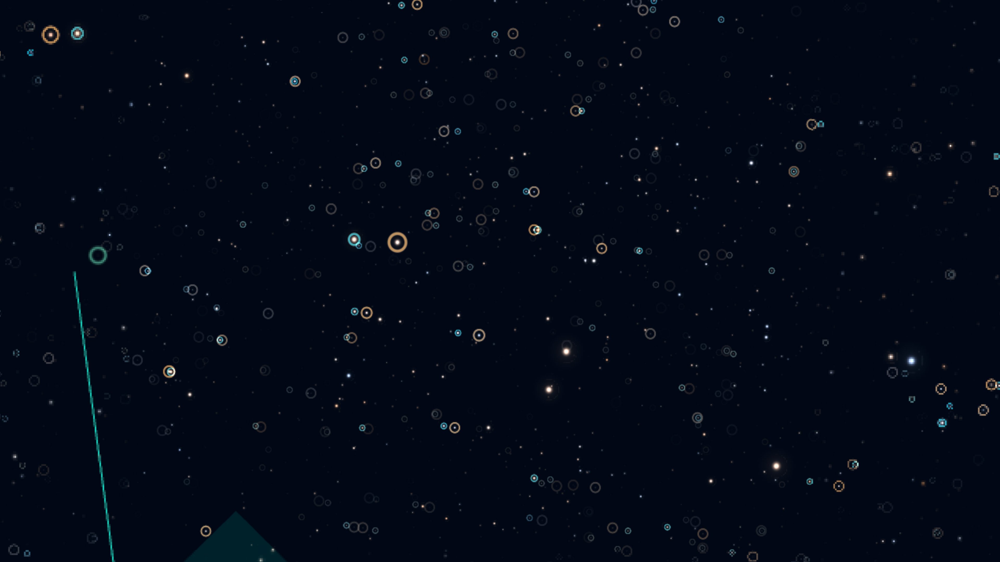
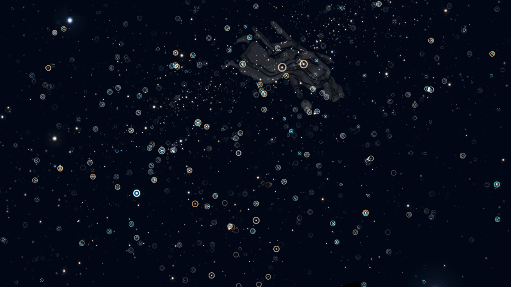

# Gaia-HIP Supplemental Display Map

Release: `20260515.1`

This publication contains a `15,916`-row Gaia-Hipparcos2 mapping delta used to
reduce visually duplicated stars and radial "finger of god" artefacts in Found
in Space rendering. It is applied alongside the official Gaia
`hipparcos2_best_neighbour` table, which is not republished here.

## Scientific boundary

This is a visual de-duplication aid, not a scientific crossmatch. A row says
that two catalogue entries should be collapsed in this display context; it
does not claim that they are the same physical star, that either catalogue is
wrong, or that either source should be removed from scientific analysis.

Gaia and Hipparcos may differ or fail to record the same objects for many
reasons, including observing epoch, astrometric uncertainty, multiplicity,
variability, catalogue selection, and problematic solutions. Establishing
physical identity requires more detailed analysis than this display policy.

## Catalog

`catalog/fis_gaia_hip_supplemental_display_map.parquet`

```text
gaia_source_id       uint64
hip_source_id        uint64
mapping_source       string
number_of_neighbours int16
angular_distance     float32 (arcsec)
```

All `15,916` rows are one-to-one and have
`mapping_source = fis_raw_sky_render_v1`.

## Selection summary

Hipparcos positions were propagated to the Gaia epoch and compared with Gaia
DR3 sources within `5 arcsec`. Supplemental display pairs must be locally
one-to-one, must not conflict with the official best-neighbour or neighbourhood
tables, and must satisfy either:

- sky separation `<= 0.25 arcsec`; or
- sky separation `<= 5 arcsec` and rendered 3D separation `<= 1 pc`.

Magnitude and colour are diagnostic evidence only, not hard gates. The scan
produced `126,220` evidence pairs and `15,916` supplemental display rows:
`15,725` through the tight-sky rule and `191` through the rendered-distance
rule.

## Evidence

- `evidence/gaia_hip_display_match_evidence.parquet` - full decision evidence.
- `evidence/gaia_hip_display_match_report.json` - thresholds and row counts.
- `evidence/gaia_g15_parallax_download.adql` and related JSON files - Gaia
  acquisition and conversion provenance.
- `evidence/hip_gaia_magnitude_*` - magnitude diagnostics.
- `evidence/hip_healpix_*` - targeted-fetch footprint analysis.
- `evidence/vr_finger_of_god.jpg` and `evidence/vr_from_sun.jpg` - qualitative
  VR validation captures.





Detailed execution history is retained in `run_log.md`. `PAPER.md` provides a
short narrative summary.

## Licence and references

Found in Space original material is released under CC BY 4.0. Upstream Gaia,
Hipparcos/Tycho, and VizieR/CDS terms and credit requirements continue to
apply. See `LICENSE.txt`, `NOTICE.md`, and `REFERENCES.md`.
